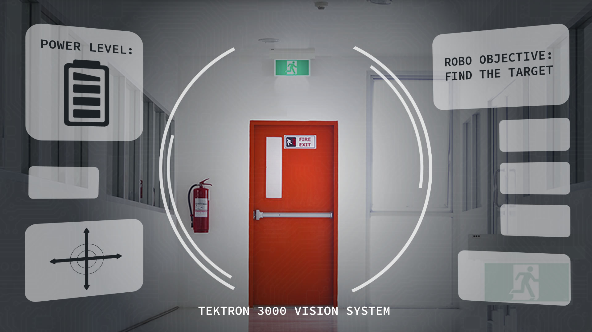

# 16. Challenge: Color Filters

### Filtering visual data, like red doors, is a major task for roboticists. The following program is designed to find the door in the photo below..

In this programming quiz we've given you code to filter for the red door. All you have to do is run the code and look at the output.

In the output you'll see:

* the original image
* the filter for red
* the filtered image

If you like, change the upper and lower range values to change the filter.

The code is executed when you select the "Test Run" button.

When you submit the code, all answers are correct.